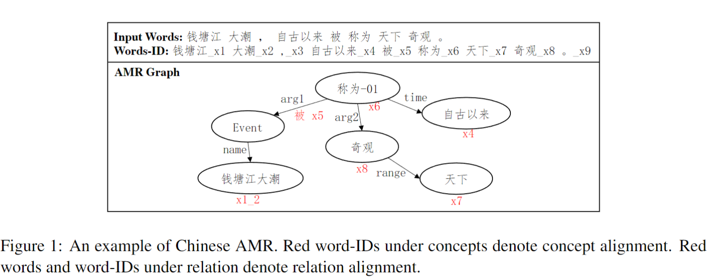
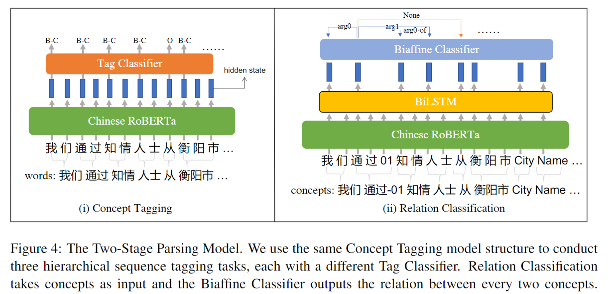

# Two-Stage-Chinese-AMR-Parsing

English | **[中文](https://github.com/chenllliang/Two-Stage-CAMRP)**

Source code for paper "A Two-Stage Graph-Based Method for Chinese AMR Parsing with Explicit Word Alignment" @ CAMRP-2022 & CCL-2022.

Our system “PKU@CAMRP-2022” won the second place at [CAMRP-2022](https://github.com/GoThereGit/Chinese-AMR#%E8%AF%84%E6%B5%8B%E6%8E%92%E5%90%8D) evaluation held with CCL-2022 conference.

Please feel free to ask whenever you meet problems during reproduing our results.


<br>

<div align=center>
<b>An example of Chinese AMR Parsing</b>
<br>



</div>

<br><br>


<div align=center>
<b>Two-Stage Model Illustration</b>
<br>
 


</div>


## 📕Preparations

python: 3.7.11

```shell
conda create -n camrp python=3.7
pip install -r requirement.txt # make sure you have correct cuda version for torch, we use torch-1.10.1+cu113
```

### IMPORTANT
you need to replace some files in transformers with our modified ones
- replace `/miniconda3/envs/camrp/lib/python3.7/site-packages/transformers/models/bert/modeling_bert.py` with `./src/modeling_bert.py`
- replace `/miniconda3/envs/camrp/lib/python3.7/site-packages/transformers/modeling_outputs.py` with `./src/modeling_outputs.py`


### To Reproduce our Result

To reproduce the result in the paper, you can directly jump to [Inference](https://github.com/chenllliang/Two-Stage-CAMRP/blob/main/README_en.md#inference) section (no need for dataset prepare, preprocess and train)


## 📕Dataset Prepare

Before starting, you need collect the CAMR and CAMR tuple data from CAMRP-2022 and place them under `./datasets` as below:

The `./datasets/vocabs` is provided in this repo.

```bash
/Two-Stage-CAMRP/datasets
├── camr
│   ├── camr_dev.txt
│   └── camr_train.txt
├── camr_tuples
│   ├── tuples_dev.txt
│   └── tuples_train.txt
└── vocabs
    ├── concepts.txt
    ├── eng_predicates.txt
    ├── nodes.txt
    ├── predicates.txt
    ├── ralign.txt
    └── relations.txt
```

## 📕Preprocess

First, we need to transform the original Chinese AMR Annotations into 5 different sub-tasks in the Two-Stage method. 

The tasks include
1. Surface Tagging 
2. Normalization Tagging
3. Non-Aligned Concept Tagging
4. Relation Classification 
5. Relation Alignment Classification

`./scripts/preprocess.py` will automaticly generate preprocessed data for the five tasks given correct path for CAMR2.0 dataset and the tuple version of the dataset.

(Recommended) We also provide a processed version of data under `./preprocessed`, that you could directly use.

The full preprocessed data (we have provided all of them) should look like belows:

```bash
/Two-Stage-CAMRP/preprocessed
├── non_aligned_concept_tagging
│   ├── dev.extra_nodes
│   ├── dev.extra_nodes.tag
│   ├── dev.sent
│   ├── train.extra_nodes
│   ├── train.extra_nodes.tag
│   ├── train.sent
│   └── train.tag.extra_nodes_dict
├── normalization_tagging
│   ├── dev.p_transform
│   ├── dev.p_transform_tag
│   ├── dev.sent
│   ├── train.p_transform
│   ├── train.p_transform_tag
│   └── train.sent
├── relation_classification
│   ├── dev.4level.relations
│   ├── dev.4level.relations.literal
│   ├── dev.4level.relations_nodes
│   ├── dev.4level.relations_nodes_no_r
│   ├── dev.4level.relations.no_r
│   ├── relation_alignment_classification
│   │   ├── dev.4level.ralign.relations
│   │   ├── dev.4levelralign.relations.literal
│   │   ├── dev.4level.ralign.relations_nodes
│   │   ├── train.4level.ralign.relations
│   │   ├── train.4levelralign.relations.literal
│   │   └── train.4level.ralign.relations_nodes
│   ├── train.4level.relations
│   ├── train.4level.relations.literal
│   ├── train.4level.relations_nodes
│   ├── train.4level.relations_nodes_no_r
│   └── train.4level.relations.no_r
└── surface_tagging
    ├── dev.sent
    ├── dev.tag
    ├── train.sent
    └── train.tag

5 directories, 33 files
```

## 📕Train

```bash


export CUDA_VISIBLE_DEVICES=0
# train following tasks individually. It takes about 1 day to train all tasks on a single A40 GPU

cd scripts/train

python train_surface_tagging.py
python train_normalization_tagging.py
python train_non_aligned_tagging.py


python train_relation_classification.py
python train_relation_alignment_classification.py

# the trained models will be saved under /Two-Stage-CAMRP/models
```


## 📕Inference

To reproduce our result, you need to first download all five models from [Google Drive](https://drive.google.com/drive/folders/1zkWlgyVYvoZTcXzZsC4GABFRKXHr9pUa?usp=sharing) or [PKU Drive](https://disk.pku.edu.cn:443/link/B9082FEBBE8AF0210486969549C65D52) or [阿里云盘](https://www.aliyundrive.com/s/ad1VTLhUBgy) or train them yourself. After gaining the models, place the five models' folders under `./models/trained_models`. 

Run following script, you will get the model prediciton of TestA of CAMRP-2022 under `./results` folder. [Link](https://github.com/chenllliang/Two-Stage-CAMRP/blob/main/result/testA.with_r.with_extra.relation.literal.sync_with_no_r.with_func_words.camr_tuple)


```bash
export CUDA_VISIBLE_DEVICES=0

cd scripts/eval

python inference_surface_tagging.py ../../models/trained_models/surface_tagging/checkpoint-125200 ../../test_A/test_A_with_id.txt ../../result/testA

python inference_normalization_tagging.py ../../models/normalization_tagging/checkpoint-650 ../../test_A/test_A_with_id.txt ../../result/testA

python inference_non_aligned_tagging.py ../../models/trained_models/non_aligned_tagging/checkpoint-1400 ../../test_A/test_A_with_id.txt ../../result/testA


bash inference.sh ../../result/testA.surface ../../result/testA.norm_tag ../../result/testA.non_aligned ../../test_A/test_A.txt ../../result/testA ../../models/trained_models/relation_cls/checkpoint-32400 ../../models/trained_models/relation_align_cls/checkpoint-33000

```


## 📕Scoring with AlignSmatch

The AlignSmatch tools are from [CAMRP 2022](https://github.com/GoThereGit/Chinese-AMR/tree/main/tools)

```
cd ./Chinese-AMR/tools

python Align-smatch.py -lf ../data/test/test_A/max_len_testA.txt -f ../../result/testA.with_r.with_extra.relation.literal.sync_with_no_r.with_func_words.camr_tuple ../../test_A/gold_testa.txt --pr

# Result for the provided model
# Precision: 0.78  Recall: 0.76  F-score: 0.77
```


## 📕Reference

Coming Soon ~
